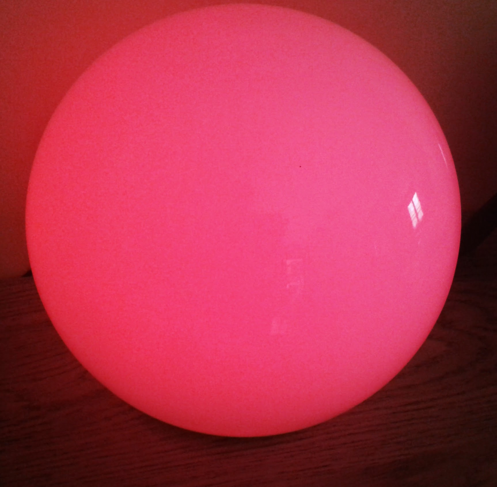
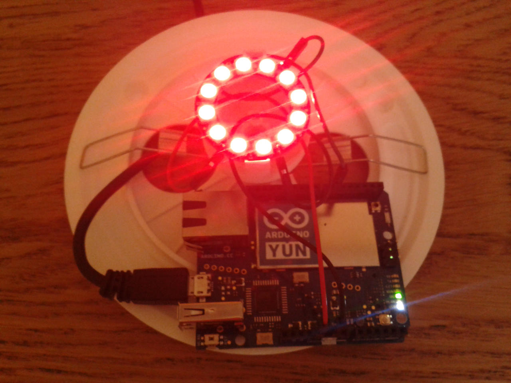

arduino.yun.ikea-fado
=====================

Hack of an Ikea Fado lamp with Arduino Yun/RGB Neopixel and 
MQTT protocol.

The NeoPixel is connect to the Yun with 3 wires :
- Yun "GND" to NeoPixel "GND".
- Yun "5V" to NeoPixel "5V DC Power".
- Yun Digital PIN #6 to NeoPixel "Data input".

I remove the electric lamp part and set a NeoPixel Ring into.

Like this :

At startup Arduino YUN sketch subscribe to "test/color" MQTT topic.

To set the color of the Fado, you just have to send an MQTT publish to 
test/color topic.

Like this for color RED:

    mosquitto_pub -h 192.168.1.60 -t test/color -m ff0000

Products available here :

- Fado Lamp http://www.ikea.com/fr/fr/catalog/products/80096372/
- Yun card http://store.arduino.cc/product/A000008
- 12 Neopixel Ring https://www.adafruit.com/products/1643
